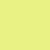

# Palette

## Base Colors

|     Name     |  Hex Code   |   RGB   |            Preview             |
| :---: | :---: | :------: | :------: |
|  Background  | #10111b | (16, 17, 27) |    |
| Background 2 | #090A0F | (9, 10, 15) |  |
| Background 3 | #403a72 | (64, 58, 114) |  |
|    Black     | #1f1f27 | (31, 31, 39) |         |
|    White     | #f9f7f2 | (249, 247, 242) |         |
| Foreground 1 | #ff058d | (255, 5, 141) |  |
| Foreground 2 | #9200ff | (146, 0, 255) |  | 

## Other Colors

| Name    | Hex Code    |   RGB   | Preview                     |     | Name     | Hex Code    |   RGB   | Preview                     |
| ------- | ------- | ------- | --------------------------- | --- | -------- | ------- | ------- | --------------------------- |
| Orange  | #f46e00 | (244, 110, 0) |   |     | Orange 2 | #f5ac00 | (245, 172, 0) |   |
| Red     | #f70047 | (247, 0, 71) |      |     | Red 2    | #ff5555 | (255, 85, 85) |      |
| Green   | #00ff7d | (0, 255, 125) |    |     | Green 2  | #55ff55 | (85, 255, 85) |    |
| Yellow  | #fcdd42 | (252, 221, 66) |   |     | Yellow 2 | #ffff55 | (255, 255, 85) |   |
| Blue    | #26b3d2 | (38, 179, 210) |     |     | Blue 2   | #729fcf | (114, 159, 207) |     |
| Purple  | #9200ff | (146, 0, 255) |   |     | Purple 2 | #ff0eff | (255, 14, 255) |   |
| Pink    | #ea748f | (234, 116, 143) |     |     | Pink 2   | #34e2e2 | (52, 226, 226) |     |
| White 2 | #d3d7cf | (211, 215, 207) |  |     | White 3  | #eeeeec | (238, 238, 236) |    |

## Additional Colors

### Blacks
|   Name   |  Hex Code   |   RGB   |           Preview            |
| :---: | :---: | :------: | :------: |
| Black01  | #090A0F | (9, 10, 15) |   |
| Black02  | #191A21 | (25, 26, 33) |   |
| Black03  | #1F1F27 | (31, 31, 39) |   |
| Black04  | #10111B | (16, 17, 27) |   |
| Black05  | #21222C | (33, 34, 44) |   |
| Black06  | #343746 | (52, 55, 70) |   |
| Black07  | #424450 | (66, 68, 80) |   |

### Whites
|   Name   |  Hex Code   |   RGB   |           Preview            |
| :---: | :---: | :------: | :------: |
| White01  | #E1EFFF | (225, 239, 255) |   |
| White02  | #E9E9E9 | (233, 233, 233) |   |
| White03  | #F9F7F2 | (249, 247, 242) |   |
| White04  | #F9F9F2 | (249, 249, 242) |   |
| White05  | #FFFFFF | (255, 255, 255) |   |

### Purples
|   Name   |  Hex Code   |   RGB   |           Preview            |
| :---: | :---: | :------: | :------: |
| Purple01 | #8700D9 | (135, 0, 217) |  |
| Purple02 | #9200FF | (146, 0, 255) |  |
| Purple03 | #983DFF | (152, 61, 255) |  |
| Purple04 | #973DFD | (151, 61, 253) |  |
| Purple05 | #A83DFF | (168, 61, 255) |  |
| Purple06 | #C832FF | (200, 50, 255) |  |

### Pinks
|   Name   |  Hex Code   |   RGB   |           Preview            |
| :---: | :---: | :------: | :------: |
|  Pink02  | #E700D8 | (231, 0, 216) |   |
|  Pink01  | #FF92DF | (255, 146, 223) |   |
|  Pink03  | #EA00D9 | (234, 0, 217) |   |
|  Pink04  | #FF15EF | (255, 21, 239) |   |
|  Pink05  | #FD21EF | (253, 33, 239) |   |
|  Pink06  | #FF22F0 | (255, 34, 240) |   |
|  Pink07  | #FF25F0 | (255, 37, 240) |   |
|  Pink08  | #FF2CF1 | (255, 44, 241) |   |

### Reds
|   Name   |  Hex Code   |   RGB   |           Preview            |
| :---: | :---: | :------: | :------: |
|  Red01   | #9E0A52 | (158, 10, 82) |    |
|  Red02   | #F70047 | (247, 0, 71) |    |
|  Red03   | #E92778 | (233, 39, 120) |    |
|  Red04   | #EC107B | (236, 16, 123) |    |
|  Red05   | #FF058D | (255, 5, 141) |    |
|  Red06   | #FF0081 | (255, 0, 129) |    |
|  Red07   | #EA748F | (234, 116, 143) |    |
|  Red08   | #FF69B4 | (255, 105, 180) |    |

### Greens
|   Name   |  Hex Code   |   RGB   |           Preview            |
| :---: | :---: | :------: | :------: |
| Green01  | #00FF7D | (0, 255, 125) |   |
| Green02  | #69FF94 | (105, 255, 148) |   |
| Green03  | #76FFF9 | (118, 255, 249) |   |
| Green04  | #A4FFFF | (164, 255, 255) |   |

### Blues
|   Name   |  Hex Code   |   RGB   |           Preview            |
| :---: | :---: | :------: | :------: |
|  Blue01  | #0685FC | (6, 133, 252) |   |
|  Blue02  | #D6ACFF | (214, 172, 255) |   |
|  Blue03  | #8BE9FE | (139, 233, 254) |   |
|  Blue04  | #009AF3 | (0, 154, 243) |   |
|  Blue05  | #029FCF | (2, 159, 207) |   |
|  Blue06  | #5994CE | (89, 148, 206) |   |
|  Blue07  | #44A1FD | (68, 161, 253) |   |
|  Blue08  | #35A3FD | (53, 163, 253) |   |
|  Blue09  | #40A9FF | (64, 169, 255) |   |
|  Blue10  | #2FB3FF | (47, 179, 255) |   |
|  Blue11  | #26B3D2 | (38, 179, 210) |   |
|  Blue12  | #18B6FF | (24, 182, 255) |   |
|  Blue13  | #6AB0FF | (106, 176, 255) |   |
|  Blue14  | #67B3FF | (103, 179, 255) |   |
|  Blue15  | #01C8FF | (1, 200, 255) |   |
|  Blue16  | #39C0FF | (57, 192, 255) |   |
|  Blue17  | #00D7E2 | (0, 215, 226) |   |
|  Blue18  | #3EC8FF | (62, 200, 255) |   |
|  Blue19  | #0EF3FF | (14, 243, 255) |   |
|  Blue20  | #403A72 | (64, 58, 114) |   |

### Yellows
|   Name   |  Hex Code   |   RGB   |           Preview            |
| :---: | :---: | :------: | :------: |
| Yellow01 | #FF6E6E | (255, 110, 110) |  |
| Yellow02 | #DBCD00 | (219, 205, 0) |  |
| Yellow03 | #F46E00 | (244, 110, 0) |  |
| Yellow04 | #FFD400 | (255, 212, 0) |  |
| Yellow05 | #E9F284 | (233, 242, 132) |  |
| Yellow06 | #FFEE80 | (255, 238, 128) |  |
| Yellow07 | #FFFFA5 | (255, 255, 165) |  |
| Yellow08 | #FCDD42 | (252, 221, 66) |  |
| Yellow09 | #FFFF55 | (255, 255, 85) |  |
| Yellow10 | #FFDF52 | (255, 223, 82) |  |